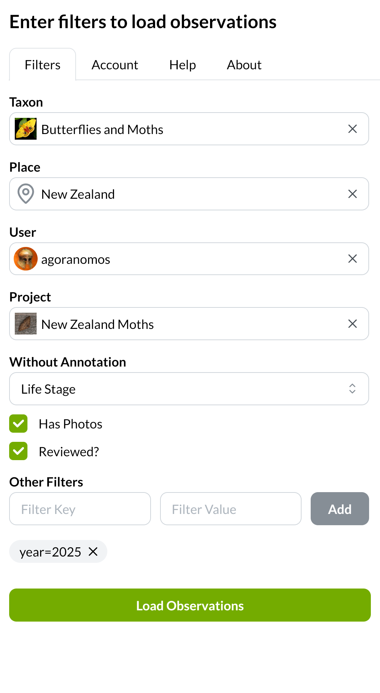
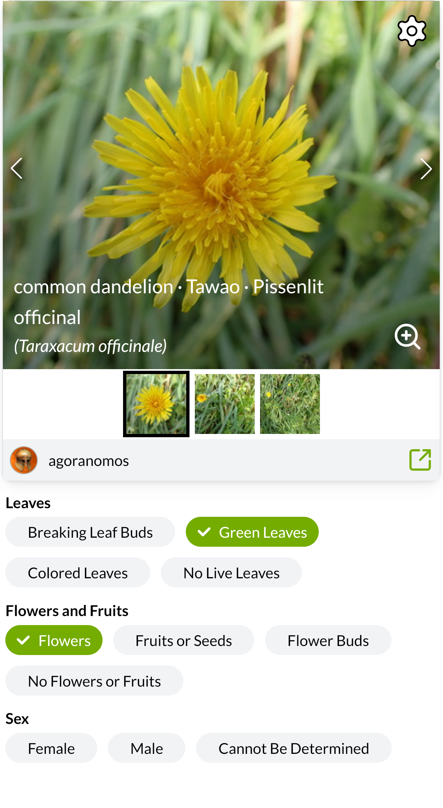
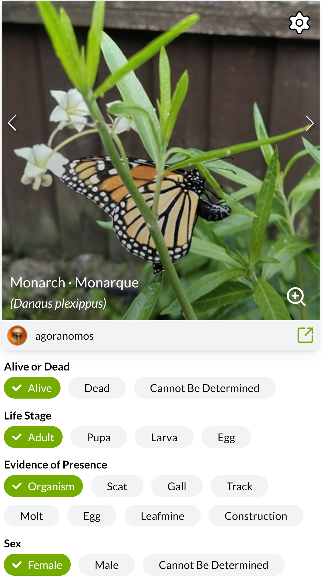

# MobiNat
This is a site of small mobile friendly tools to enhance the functionality of iNaturalist.
The first (and only) tool is the Annotator.

## Annotator
[https://mobinat.org/annotator](https://mobinat.org/annotator)

This tool allows for fast annotations, targeting mobile devices, but can be used with laptops and desktops too.

## Development Setup
- Install node and npm
- Run `npm install`

### Dev run
- Run `npm run dev` to start a local web server hosting MobiNat.

### Linting / Formatting
If you're making changes please run the linting/formatting.

#### Visual Studio Code
- Install Biome extension and set it as the default typescript formatter if you're making changes. This should auto format and warn of linting issues.

#### Command Line
- Run `npm run lint` and fix any issues.

### Authentication
Locally, the auth flow with iNaturalist doesn't work out of the box. To work around this, you can create an [.env.local file](https://vite.dev/guide/env-and-mode#env-files) with `VITE_AUTH_TOKEN` set to your personal token which you can obtain from https://www.inaturalist.org/users/api_token. This rotates every day or so.

You might be able to register your own third party app on iNaturalist with a localhost domain as a permanent way to authenticate locally, but I haven't tested that.

### Pointing to a local iNaturalist server
If you have an iNaturalist instance running locally for testing you can create an [.env.local file](https://vite.dev/guide/env-and-mode#env-files) to overwrite settings in the .env file in order to point to it.
